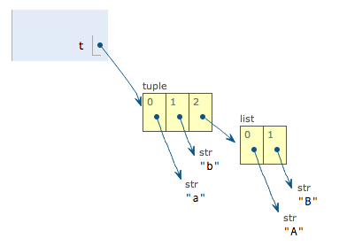

Python Basic Data Structure
===============================

## List

Python内置的一种数据类型是列表：list。list是一种有序的集合，可以随时添加和删除其中的元素

列表常用操作及其复杂度

Operation  | big O | description |
--|-- |-- |
index [] |	O(1) |	索引操作
index assignment	|	O(1)| 	索引赋值操作
append	|	O(1)|	在列表末尾添加新的对象
pop()	|	O(1)|	移除列表中的一个元素（默认最后一个元素），并且返回该元素的值
pop(i)	|	O(n)|	移除列表中索引位置的值，并且返回该元素的值
insert(i,item)	|	O(n)|	将对象插入列表索引i位置
del operator	|	O(n)|	删除列表的的元素
iteration	|	O(n)|
contains (in)	|	O(n)|
get slice [x:y]	|	O(k)|
del slice	|	O(n)|
set slice	|	O(n+k)|
reverse	|	O(n)|	反向列表中元素
remove | O(n) | 移除列表中某个值的第一个匹配项
concatenate	|	O(k)|
sort	|	O(n log n)|	列表排序
multiply	|	O(nk)|


## Dictionary

Python内置了字典：dict的支持，dict全称dictionary，在其他语言中也称为map，使用键-值（key-value）存储，具有极快的查找速度。dict内部存放的顺序和key放入的顺序是没有关系的。
dict的key必须是**不可变对象**。这是因为dict根据key来计算value的存储位置，如果每次计算相同的key得出的结果不同，那dict内部就完全混乱了。这个通过key计算位置的算法称为**哈希算法**（Hash）

和list比较，dict有以下几个特点：

- 查找和插入的速度极快，不会随着key的增加而变慢；
- 需要占用大量的内存，内存浪费多。

而list相反：

- 查找和插入的时间随着元素的增加而增加；
- 占用空间小，浪费内存很少。

所以，dict是用空间来换取时间的一种方法

## Tuple

tuple和list非常类似，但是tuple一旦初始化就不能修改

#### Tuple 的不可变性

元组一旦创建，它的元素就是不可变的， 例如如下：

``` Python
t = ('a', 'b', ['A', 'B'])
t[2][0] = 'X'
t[2][1] = 'Y'
print t
```



当我们把list的元素'A'和'B'修改为'X'和'Y'后，tuple变为：


Tuple的每个元素，指向永远不变，其中如果某个元素本身是可变的，那么元素内部也是可变的，但是元组的指向却是没有变化
